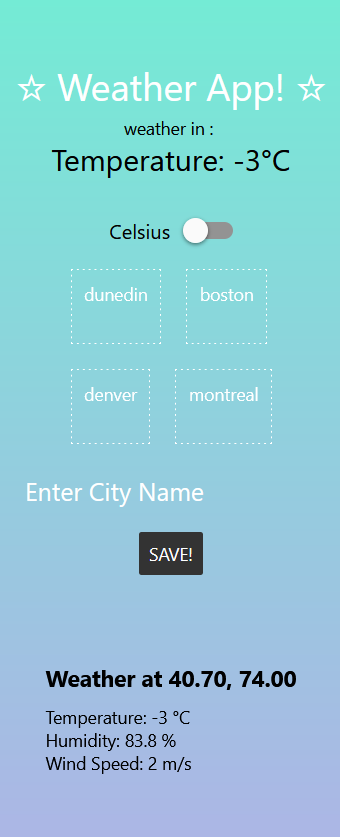
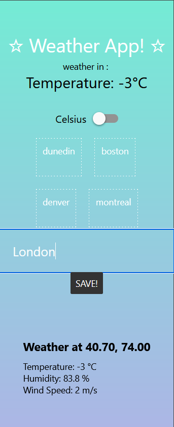
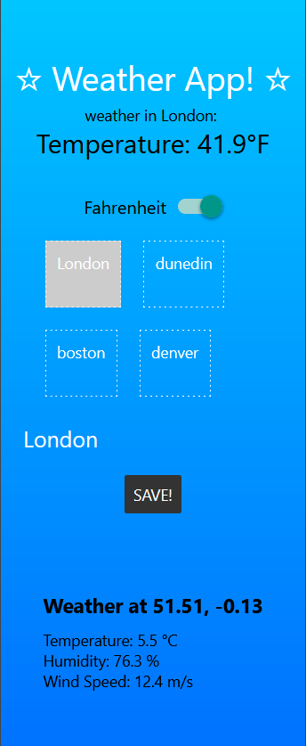
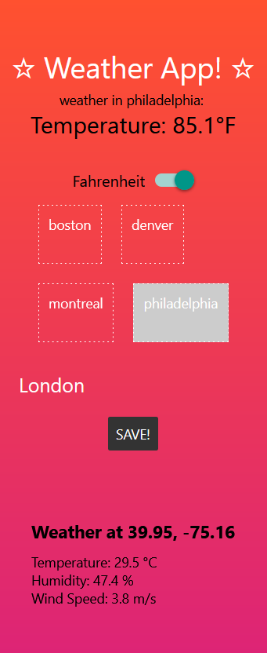
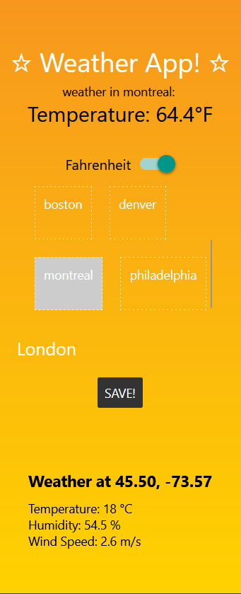

# WeatherApp - Dynamic Weather React Native Expo App (w/ Node.js + Express & SQLite) ☆

## Design and Purpose

This app is designed to allow people to view the weather for whatever city they may choose! The cities the user adds are saved to the database and can be acessed for future use! The applications changes dynamically to the weather conditions <3 See temperature in celsius OR fahrenheit!!!!!!

## Basic Use

Using the app is simple:

1. Open the app.
2. Type a name of a city into the box
3. The weather will now be displayed on the screen and the city will be saved to the list for future access!

## Screenshots

## Server API Explanation

The Backend of the application uses two third-party APIs to gather the weather data and coordinates from city names: Nominatim & api.met.no. They can be called from:
localhost:5000/api/coord?city= & localhost:5000/api/weather?lat=&long=

An offline SQLite database was developed to store a custom city names from the user. They data can be read/written through GET/POST methods localhost:5000/api/data & localhost:5000/api/save. the data endpoint returns a list of all the cities in the database and the save endpoint sends a new city name to the city list array in the data.db database.

## Experiences & Reflection for INFO 670

Working on this project helped me realize how I could integrate third-party API calls in my backend seamlessly with my own API. This process will definitely help me to scale to larger fullstack applications. When I encountered an error with this project, I had to test a lot of systems compared to a static web app, because the error could come from the frontend or the backend. Making sure to log in the console helped me to develop better code.

For the future of the project, I may consider deploying the application online and move out of the development process. However, to do that I might implement some other features and bugfixes:
1. Animations for various weather conditions (rain, snow, clouds, etc.)
2. Fix double click error in the saved cities
3. Add deletions of cities in list
4. Confirmation city exists before adding to list
5. clock / timezone for each city
6. future weather conditions

## Instructions for Running source code

1. Copy the source code
2. install required dependecies and update npm packages
3. run 'node server.js' in a terminal
4. run 'npx expo start' in the main directory.